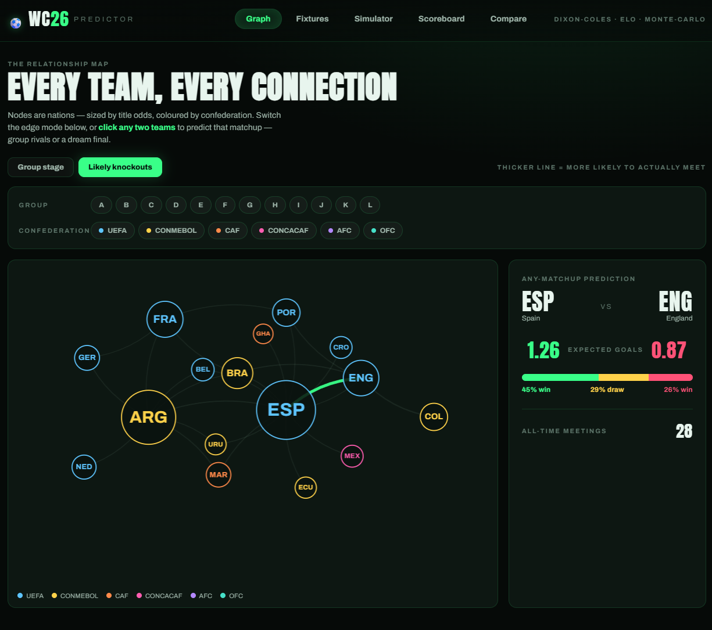
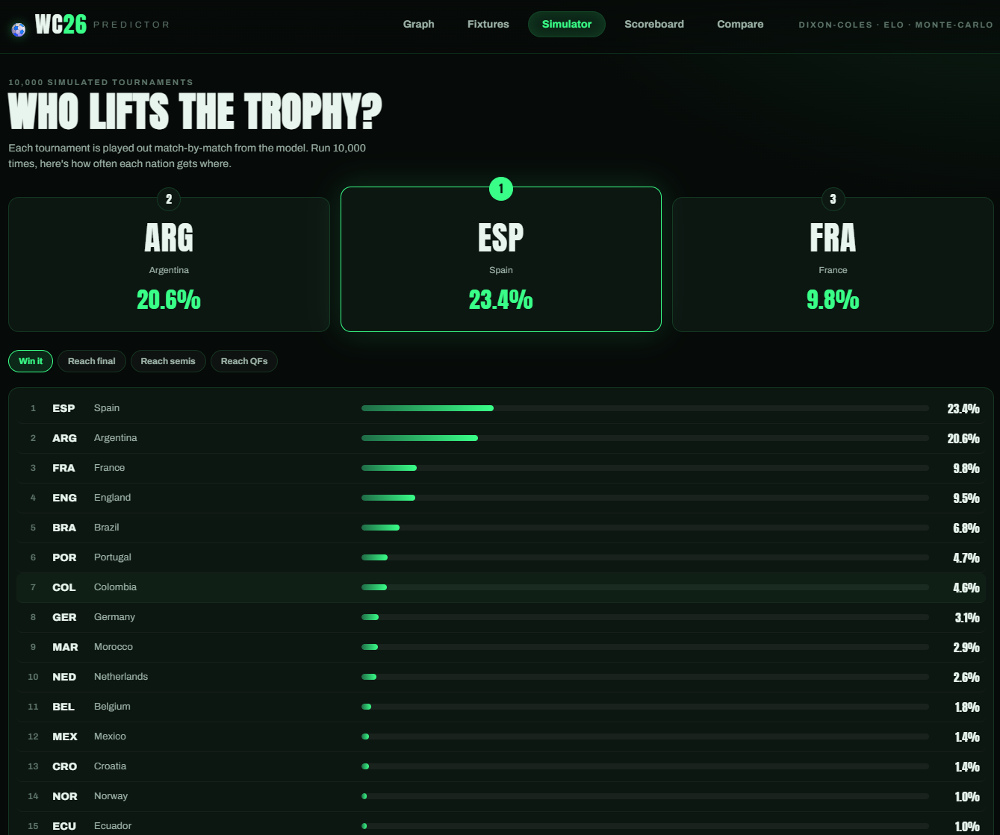
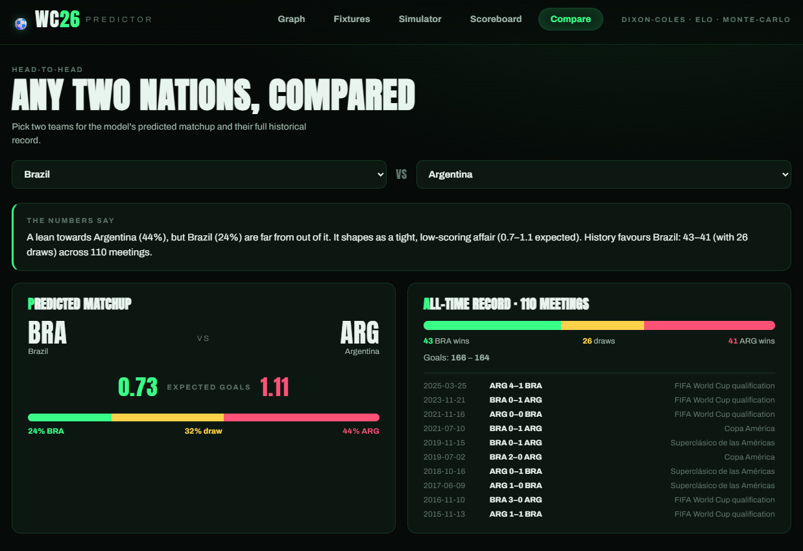

# ⚽ WC26 Predictor

**Predicting the 2026 World Cup from 154 years of match data.** A full-stack app
pairing an explainable football model — **Dixon–Coles** goals + **Elo**,
calibrated on a back-test — with a **Monte-Carlo tournament simulation** and a
stylish, broadcast-themed React frontend built around an interactive
**team-relationship graph**.

### 🔴 [**Live demo → wc26-predictor-eyat.onrender.com**](https://wc26-predictor-eyat.onrender.com)


> The 2026 World Cup is live as this was built, so predictions can be scored
> against real results.
>
> *Free-tier note: the API sleeps after ~15 min idle, so the first load may take
> ~40s to wake up.*

## Screenshots

| Relationship graph | Simulator | Head-to-head |
|---|---|---|
|  |  |  |


## What it does

- **Relationship graph** — all 48 teams as a force-directed map (sized by title
  odds, coloured by confederation). Switch edge modes — group matchups, or the
  most-likely knockout meetings (from the simulation) — or click any two teams to
  predict *any* hypothetical fixture, group rival or dream final.
- **Fixtures** — every group-stage match with expected goals and W/D/L bars.
- **Simulator** — 10,000 simulated tournaments → title / final / semi / QF odds.
- **Team profiles & head-to-head** — per-team strength and outlook; compare any
  two nations' predicted matchup and full historical record.

## The model

| Piece | What it does |
|-------|--------------|
| **Elo** (`backend/model/elo.py`) | World-Football-Elo over all history; margin-of-victory + tournament weighting. Calibrated across confederations. |
| **Dixon–Coles** (`backend/model/dixon_coles.py`) | Bivariate-Poisson attack/defence strengths via weighted MLE with recency decay + low-score correction → full scoreline distribution. |
| **Elo blend** (`backend/model/blend.py`) | Blends each match's goal supremacy from DC with Elo's — Elo corrects DC's bias toward high-scoring CONMEBOL qualifiers. |
| **Confederation calibration** (`backend/model/confed.py`) | Corrects residual cross-confederation bias — a fitted per-confederation goal-supremacy offset applied when teams from different confederations meet. |
| **Monte-Carlo** (`backend/model/simulate.py`) | Plays out the full 48-team format (groups → 32-team knockout) thousands of times for advancement + title odds. |

All model logic is **test-driven** (`backend/tests`): probability coherence,
synthetic parameter recovery, monotonicity, and API contracts. 46 tests.

### Calibration (back-tested)

Two evidence-based corrections, each validated on held-out data:

1. **Elo blend weight** (`backend/model/backtest.py`) — temporal back-test (fit
   pre-2023, score 2023–2026 by log-loss) picks w=0.5, beating Dixon–Coles alone
   **0.864 vs 0.871** over 3,597 matches.
2. **Confederation offsets** (`backend/model/confed.py`) — the blended model still
   over-rated CONMEBOL/AFC and under-rated UEFA/CAF on cross-confederation
   matches. Per-confederation offsets fit by MLE close those gaps (e.g. UEFA
   prediction error +0.18 → +0.01 pts/game) and improve held-out 2023+
   cross-confederation log-loss **0.912 → 0.898**. The result: a bookmaker-aligned
   title race (Spain, Argentina, France, England) rather than a CONMEBOL-heavy one.

## Architecture

```
backend/   FastAPI · data pipeline → Elo + Dixon–Coles + Elo blend → Monte-Carlo sim
frontend/  React + Vite + TypeScript · "Broadcast Dark" theme · react-force-graph
```

- **Backend:** Python · FastAPI · pandas · NumPy · SciPy
- **Frontend:** React · Vite · TypeScript · `react-force-graph-2d`
- **Data:** [martj42/international_results](https://github.com/martj42/international_results) (CC0) — 49,413 internationals, 1872–2026
- **Hosting:** Render (web service + static site)

## Run it locally

```bash
# Backend (from repo root)
python -m venv backend/.venv
backend/.venv/Scripts/pip install -r backend/requirements.txt   # Windows
backend/.venv/Scripts/python -m uvicorn backend.api.main:app --port 8000

# Frontend
cd frontend && npm install && npm run dev      # http://localhost:5173
```

First run downloads the dataset and fits the models (cached to `data/cache/`).

```bash
backend/.venv/Scripts/python -m pytest backend/tests          # 31 tests
backend/.venv/Scripts/python -m backend.model.backtest        # calibration grid
```
